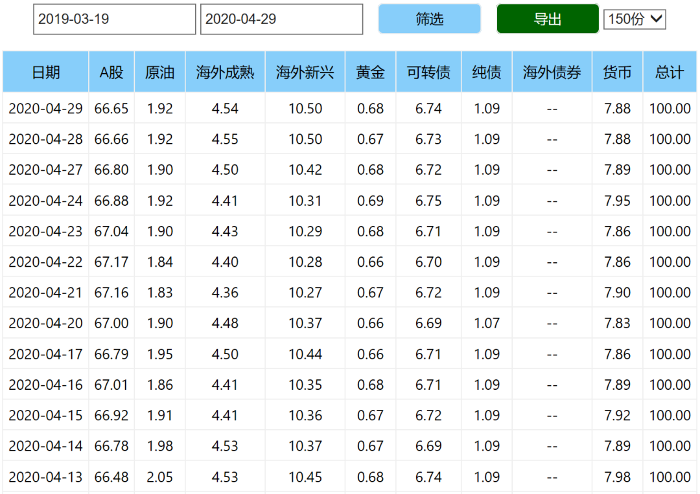
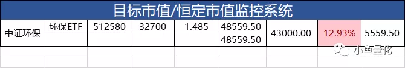
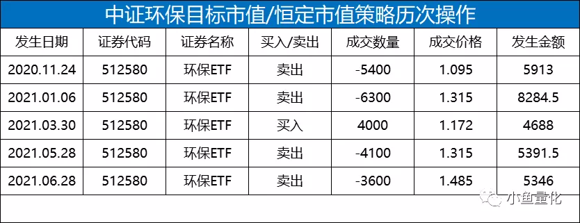

# README

## 项目目标

### 技术上

- 帮助自己熟练掌握以下技术
  - python 数据分析
  - Nodejs web\api server\爬虫

### 投资角度

- 找出中国市场中最优秀的投资标的
  - 基金公司
  - 基金经理
  - 基金
- 个人投资的辅助工具
  - 计算每天的市值
  - 资产配比
  - 投资标的跟踪

## 项目模块

- 业务模块
  - 投资标的观测
  - 投资策略的实验
  - 个人持有情况
- 服务端
  - 爬虫
  - DB

## 需求清单

目标恒定市值系统

### 系统包含3部分

1. 各投资标的的监控系统

每天根据爬取倒的基金市值，自动计算

1. 投资标的的交易记录

交易记录，记录下每一笔交易

1. 投资标的的市值记录

一个爬虫，每天定时爬取所有交易中的基金市值。从而维护大约50个基金的市值记录

### 表格设计

## 项目文档说明
